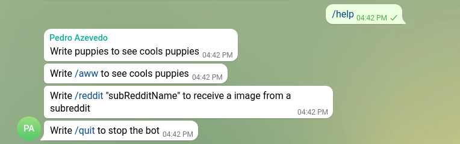
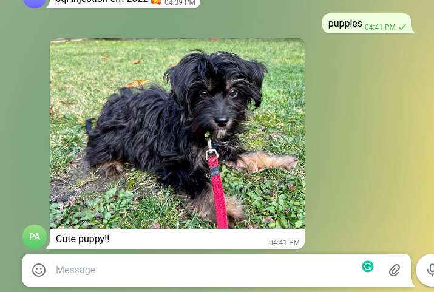

# Puppy Sender Telegram

A telegram bot that sends puppy images to a telegram user and channel.

- [Puppy Sender Telegram](#puppy-sender-telegram)
  - [How It works](#how-it-works)
  - [How to Setup](#how-to-setup)
    - [Get bot token](#get-bot-token)
    - [Create a group with the admins](#create-a-group-with-the-admins)
    - [Add bot to a group (this group will be used to receive the student requests)](#add-bot-to-a-group-this-group-will-be-used-to-receive-the-student-requests)
    - [Replace on .ENV file CHAT_ID=INSERT_ID_HERE](#replace-on-env-file-chat_idinsert_id_here)
    - [Then run it with](#then-run-it-with)
  - [Deploy](#deploy)

## How It works

First we can ask for the bot for help:



Then we can say `puppies`to get a random image from the [puppies subreddit](https://www.reddit.com/r/puppies/).



Also we can request images from specific a subReddit (use this for good, not evil)...


## How to Setup

### Get bot token

Edit .ENV file and replace BOT_TOKEN=INSERT_TOKEN with the new token

### Create a group with the admins

### Add bot to a group (this group will be used to receive the student requests)


    - Make the request in the browser https://api.telegram.org/bot<INSERT_TOKEN>/getUpdates and replace the INSERT_TOKEN with the bot token

The received json will be, get the chat id:

```json

{
    "ok": true,
    "result": [
        {
            "message": {
                "message_id": 144,
                "chat": {
                    "id": -121432131321,                   // <-------  COPY THIS ID
                    "title": "GROUP NAME",
                    "type": "group",
                    "all_members_are_administrators": true
                }
            }
        }
    ]
}

```

### Replace on .ENV file CHAT_ID=INSERT_ID_HERE

```bash

    cp .example.env .env
    vim .env

```

### Then run it with

```bash
    npm install
    make dev
    # Open telegram chat
```

## Deploy

Please see documentation in [the page install Page.](./docs/INSTALL.md).
